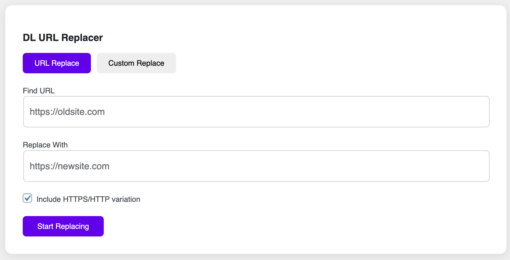
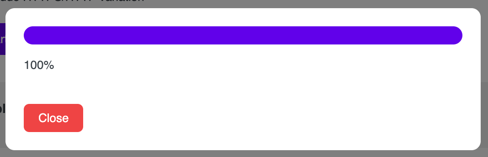

# DL URL and Text Replacer

Easily replace URLs and custom text in your WordPress database with a modern UI, AJAX progress, and detailed logs. Built with PHP OOP principles, Webpack, and WordPress coding standards.

## 🔧 Features

- Replace old/new URLs or any custom text across the WordPress database
- AJAX-based processing with progress feedback
- Material Design style backend UI
- Summary of replacements table-wise
- Modern file structure with OOP and SOLID principles
- Built using Webpack, SCSS, and core JS
- GitHub auto-update ready

## 🚀 Requirements

- WordPress 6.1 or higher
- PHP 7.4 or higher

## 📦 Installation

1. Download the plugin and upload it to `/wp-content/plugins/`.
2. Activate via **Plugins → Installed Plugins**.
3. Go to **Tools → DL URL Replacer** in the admin dashboard.
4. Use the interface to perform URL or text replacements.

## 📸 Screenshots

| Interface                                            | Description                      |
|------------------------------------------------------|----------------------------------|
|  | Admin UI with URL/Text tabs      |
|     | AJAX progress during replacement |

## ❓ FAQ

**Does this plugin support multisite?**  
Not currently. Multisite support is planned for a future release.

**Does it handle serialized data?**  
Yes. It safely processes serialized arrays and objects in the database.

**Can I undo changes?**  
Please **back up your database** before using the plugin. Undo is not supported yet, but logs help track changes.

## 📝 Changelog

### 1.0.0 – Initial Release
- URL and custom text replacement
- AJAX loader and UI
- GitHub updater integration

## 👨‍💻 Author

**DesignsLabz**  
🔗 [DesignsLabz](https://designslabz.com)  
📧 support@designslabz.com

## 📄 License

This plugin is licensed under the [GNU General Public License v3.0 or later](https://www.gnu.org/licenses/gpl-3.0.html).
