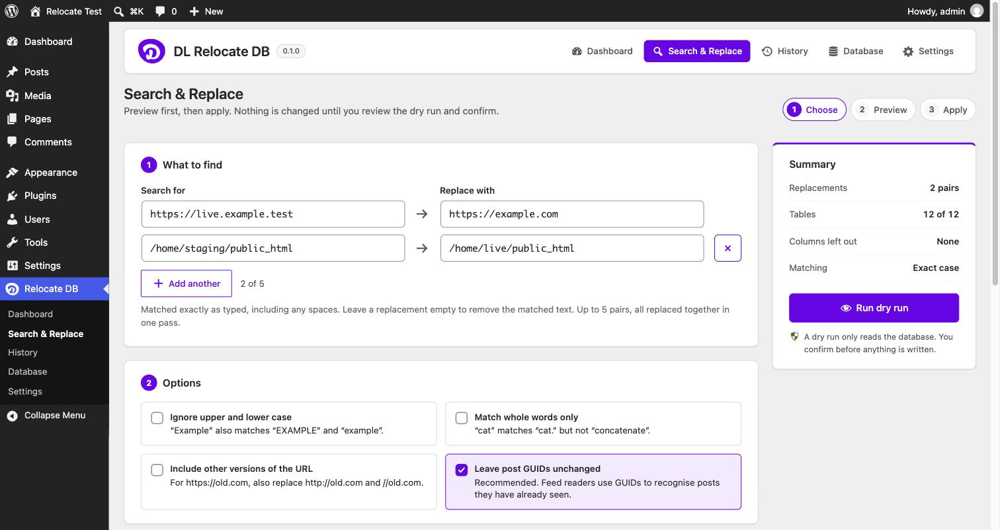
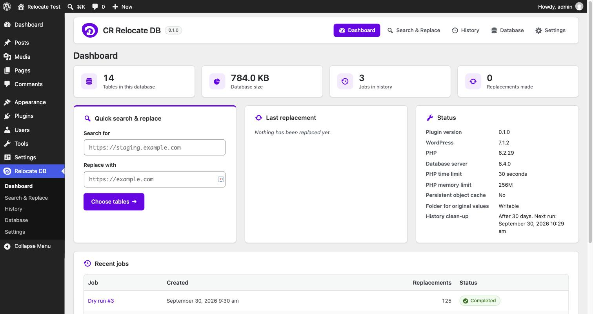
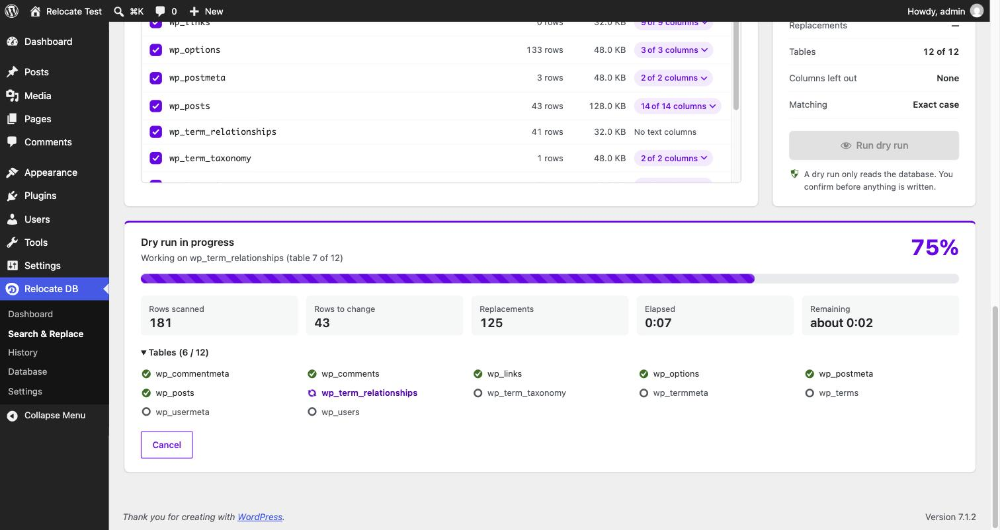
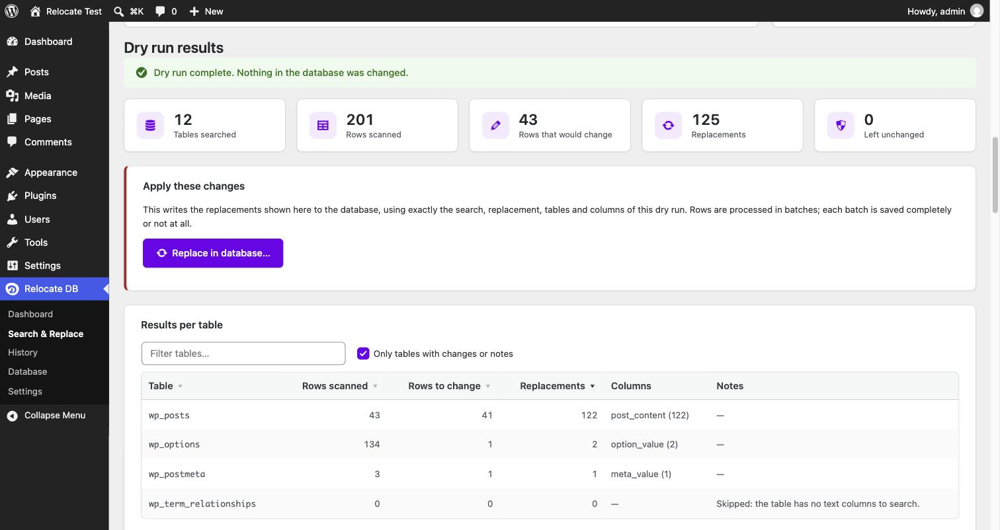
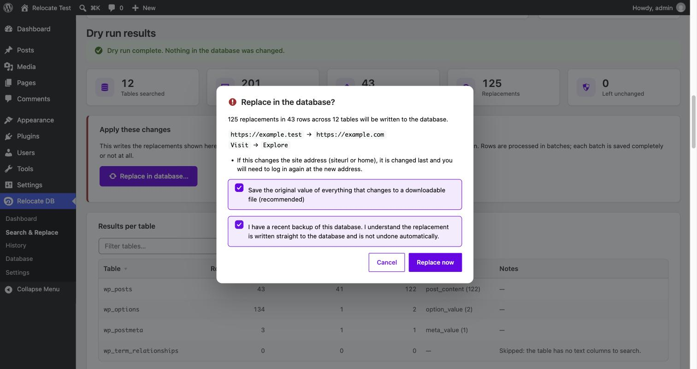
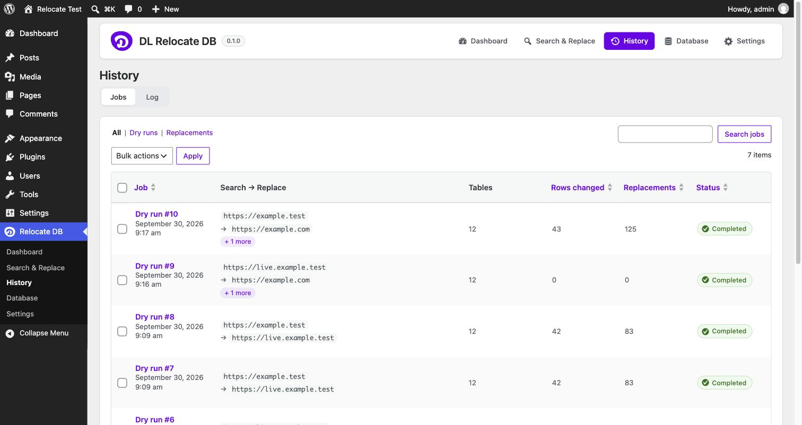

<p align="center">
  
</p>

<h1 align="center">DL Relocate DB</h1>

<p align="center">
  <strong>Safely search and replace URLs and text across your whole WordPress database.</strong><br>
  Preview every change first. Nothing is written until you say so.
</p>

<p align="center">
  
  
  
  
  <a href="https://github.com/designs-labz/dl-relocate-db/actions/workflows/ci.yml"></a>
  
</p>

<p align="center">
  
</p>

---

## 🤔 What does it do?

Moving a WordPress site almost always means changing text inside the database. For example, every link that points to your staging site has to point to your live site instead:

```text
https://staging.example.com   →   https://example.com
```

That address can appear thousands of times: in posts, menus, widgets, page builder layouts and plugin settings. **DL Relocate DB finds every one of them and changes them safely**, including the ones hidden inside data that a normal find-and-replace would break.

**Good for:**

- 🚚 Moving a site from staging to live, or live to staging
- 🌐 Changing a domain name
- 🔒 Switching from `http://` to `https://`
- 📁 Updating server paths, such as `/home/old/public_html`
- ✏️ Renaming a product, company or phrase everywhere it appears

---

## ✨ Features

- 👀 **Dry run first, always.** See exactly what would change, table by table, with before and after examples. Nothing is written until you confirm.
- 🧩 **Safe with serialized data and JSON.** Plugin settings and page builders store data in formats that break if their length changes. DL Relocate DB rewrites them correctly every time.
- ➕ **Up to 5 search and replace pairs at once.** Change your domain and your server path in a single run.
- 🎯 **Choose tables and columns.** Search all WordPress tables, only some, or leave individual columns out.
- 📊 **Live progress.** A progress bar with the current table, rows scanned, changes found and time remaining.
- 💾 **Keeps a copy of the original values.** Before anything changes, the old values are saved to a file you can download.
- 🐘 **Built for big databases.** Works in small batches, so it never times out or runs out of memory. If it is interrupted, you can continue from where it stopped.
- 🗂️ **Full history.** Every dry run and replacement is recorded, searchable and sortable, with a log.
- ⌨️ **WP-CLI support** for developers and hosting teams.
- 📱 **Works on any screen**, from a phone to a wide monitor.
- ♿ **Accessible.** Keyboard friendly, screen reader friendly, and it never relies on colour alone.

---

## 🖼️ Screenshots

| Dashboard | Choose what to replace |
|:---:|:---:|
|  |  |
| **Watch the progress** | **Review the dry run** |
|  |  |
| **Confirm before anything changes** | **Look back at every job** |
|  |  |

---

## 🚀 Getting started

### What you need

| Requirement | Version |
|---|---|
| WordPress | 6.5 or newer (a single site; see [Multisite](#-questions)) |
| PHP | 8.1 or newer |
| Database | MySQL 5.7+ or MariaDB 10.4+ |

### Install it

1. Download the plugin: on this page, click **Code → Download ZIP**.
2. In WordPress, go to **Plugins → Add New Plugin → Upload Plugin**, choose the ZIP and click **Install Now**.
3. Click **Activate**.
4. You will find **Relocate DB** in the admin menu on the left.

> 💡 **Tip:** GitHub names the folder inside the ZIP `dl-relocate-db-main`. The plugin works either way, but for tidy future updates you can unzip it, rename the folder to `dl-relocate-db`, and zip it again before uploading.

---

## 🧭 How to use it

It always works in three steps: **Choose → Preview → Apply**.

### 1️⃣ Choose what to replace

Open **Relocate DB → Search & Replace**.

- **Search for:** the text or address you want to change, for example `https://staging.example.com`.
- **Replace with:** what it should become, for example `https://example.com`.
- Need to change more than one thing? Click **➕ Add another** (up to 5 pairs).
- Pick your **options** and **tables**. The defaults are right for most sites.

### 2️⃣ Preview with a dry run

Click **Run dry run**. The plugin reads your database and shows:

- how many rows would change, and in which tables and columns;
- examples of the text before and after;
- anything it would leave alone to keep your data safe, and why.

**Nothing in your database changes during a dry run.**

### 3️⃣ Apply the changes

Happy with the preview? Click **Replace in database…**, tick the box to confirm you have a backup, and click **Replace now**. When it finishes, you can download the original values.

### ✅ Examples

| I want to… | Search for | Replace with | Options |
|---|---|---|---|
| Move staging to live | `https://staging.example.com` | `https://example.com` | Tick **Include other versions of the URL** |
| Switch to HTTPS | `http://example.com` | `https://example.com` | |
| Change the server path | `/home/staging/public_html` | `/home/live/public_html` | |
| Rename a brand | `Acme Ltd` | `Acme Group` | **Match whole words only** |

> 💡 **Tip:** use the full address, including `https://`. Searching for just `example.com` would also match `myexample.com`.

---

## 🛡️ How it keeps your site safe

- 👀 **Preview before every change.** A replacement can only be started from a finished dry run, and does exactly what the preview showed.
- 🧩 **No broken data.** Serialized settings and JSON are rewritten correctly. If a value could not be changed safely, it is left as it was and listed in the results.
- 🧱 **All or nothing per batch.** Rows are changed in small batches, and each batch is either saved completely or not at all.
- 💾 **Original values saved.** Before anything is written, the old values go into a downloadable file.
- 🏠 **Stays logged in.** Your site address is changed last, so you are not logged out part way through.
- 🔐 **Administrators only.** Only users who can manage the site and post unfiltered HTML can use it.

> ⚠️ **Always take a full backup of your database first.** The file of original values helps, but it is not a replacement for a proper backup.

---

## ❓ Questions

<details>
<summary><strong>Can I undo a replacement?</strong></summary>

There is no undo button. But each replacement can save the original value of everything it changed to a `.sql.gz` file. Importing that file puts the old values back, for example with phpMyAdmin, or:

```bash
gunzip -c relocate-job-12-original-values.sql.gz | mysql your_database
```

It overwrites any edits made to those values since, so use it soon after the replacement.
</details>

<details>
<summary><strong>What if I close the page while it is running?</strong></summary>

Nothing breaks. The batch in progress either finishes or is rolled back. Open the job from the **Dashboard** or **History** and click **Continue**. It carries on from the last completed batch.
</details>

<details>
<summary><strong>Why were some values "left unchanged"?</strong></summary>

Sometimes changing a value would damage it: for example, plugin data that was already broken, or a custom format only that plugin understands. DL Relocate DB leaves those alone and tells you which table they are in, so you can check them yourself.
</details>

<details>
<summary><strong>Does it work on large sites?</strong></summary>

Yes. It works through each table in small batches, a few seconds at a time, so it does not hit time or memory limits. If your pages are very large (for example page builder content), lower **Rows per batch** in **Settings**.
</details>

<details>
<summary><strong>Does it support Multisite?</strong></summary>

Not yet. On a Multisite network it shows a notice and does not run. Multisite support is planned.
</details>

<details>
<summary><strong>Does it send my data anywhere?</strong></summary>

No. Everything happens inside your own database. Nothing is sent to DesignsLabz or anyone else.
</details>

---

## ⌨️ WP-CLI

Prefer the command line? The same features are available through WP-CLI:

```bash
# Preview only: nothing is changed
wp dlz search-replace https://staging.example.com https://example.com --dry-run

# Preview, then apply after you confirm
wp dlz search-replace https://staging.example.com https://example.com

# Two pairs at once, only in two tables, without the confirmation question
wp dlz search-replace https://staging.example.com https://example.com /home/staging /home/live \
  --tables=wp_posts,wp_postmeta --yes

# Continue a job that was interrupted
wp dlz resume 42
```

Run `wp help dlz search-replace` to see every option.

---

## 🗺️ What's next

- 🌐 **Multisite support**: choose which sites of a network to update.
- ⭐ **DL Relocate DB Pro** (planned): automatic backups, one-click rollback, saved profiles, scheduled jobs and moving databases between sites.

Ideas or problems? [Open an issue](https://github.com/designs-labz/dl-relocate-db/issues).

---

## 🧑‍💻 For developers

<details>
<summary><strong>How the code is organised</strong></summary>

| Part | Where |
|---|---|
| Replacing within one value: plain text, serialized PHP, JSON | `src/Replace/` (no WordPress dependency) |
| Table discovery and allowlisting | `src/Database/Schema.php` |
| Jobs: batching, transactions, resume, original values file, clean-up | `src/Jobs/` |
| REST API used by the admin screens | `src/Rest/` (`dlz-relocate/v1`) |
| Admin screens | `src/Admin/`, `templates/admin/`, `assets/` |
| WP-CLI | `src/Cli/Command.php` |

The admin screens and WP-CLI create jobs through `JobStarter` and run them with `JobRunner::step()`, so both behave the same way.
</details>

<details>
<summary><strong>Hooks</strong></summary>

| Hook | Type | What it does |
|---|---|---|
| `dlz_relocate_step_seconds` | filter | How long one step may work before saving and returning. Default `4`. |
| `dlz_relocate_max_pairs` | filter | How many search and replace pairs one job may have. Default `5`. |
| `dlz_relocate_manage` | capability | Required for everything. Maps to `manage_options` plus `unfiltered_html`; change it with a `map_meta_cap` filter. |
</details>

<details>
<summary><strong>Development setup and tests</strong></summary>

Classes load through the PSR-4 autoloader in `dl-relocate-db.php`, so the plugin runs straight from a Git checkout. Composer is only needed for development tools.

```bash
composer install
composer lint              # PHPCS (WordPress-Extra)
composer analyse           # PHPStan level 6
composer test              # Unit tests, no WordPress or database needed
```

Integration tests run against a real WordPress and MySQL. They drop and recreate tables in the database you point them at, so use an empty one:

```bash
WP_TESTS_DB_HOST=127.0.0.1:3306 WP_TESTS_DB_NAME=relocate_tests composer test:integration
```

`WP_TESTS_DB_USER` and `WP_TESTS_DB_PASSWORD` default to `root` and an empty password.

Regenerate the translation template after changing strings:

```bash
wp i18n make-pot . languages/dl-relocate-db.pot --exclude=vendor,tests
```

CI runs the linters, the unit tests on PHP 8.1–8.4, and the integration tests on WordPress 6.5 and the latest release against MySQL 8.0, MySQL 8.4 and MariaDB 10.11.
</details>

---

## 📄 License

GPL-3.0-or-later. Free to use, change and share.

<p align="center">
  Made with 💜 by <a href="https://designslabz.com/"><strong>DesignsLabz</strong></a>
</p>
